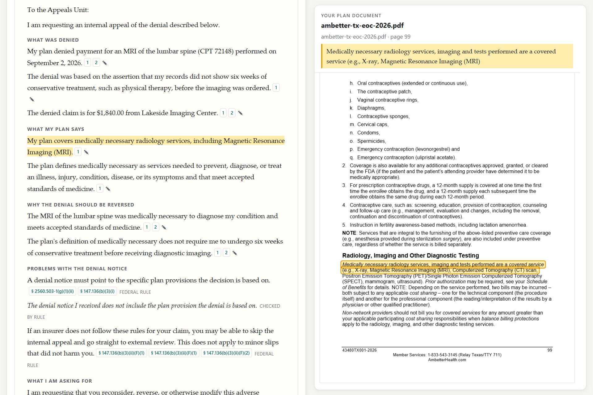

# Clause

A health insurance assistant that reads your own plan and only tells you what it can point to: your appeal deadline, what your denial notice left out, whether your EOB is right, and a drafted appeal in which every sentence cites the words it rests on. Built for ML Build Challenge 3; the brief is in [docs/BRIEF.md](docs/BRIEF.md).

**Live demo:** https://clause-p7uk.onrender.com (free instance: the first load can take up to a minute while it wakes). The bundled synthetic cases need no upload.



> Information about your own plan documents, not legal or medical advice. Federal minimums only; your state may give you more. Clause drafts; you decide what to send. It never contacts an insurer or provider.

## How it stays honest

1. **Every paragraph gets an address.** Plan documents, the denial letter or EOB, and the federal regulations are split into clauses: an id, document, page, line boxes and exact text ([`clause/index`](backend/clause/index)).
2. **The model may only point.** Gemini Flash locates facts and drafts claims, and every claim must quote the clause it rests on: `{text, citations: [{doc, clause_id, quote}]}`.
3. **Code checks the pointing.** The [grounding verifier](backend/clause/verify/verifier.py) checks four things for every citation:
   - the clause exists and belongs to the cited document
   - the quote appears in it, word for word, after normalisation
   - the quote is long enough to mean something
   - every amount, percentage, day count and hour count in the claim appears in a cited quote

   A claim that fails is greyed out with the reason and never shown as fact. If you edit a drafted sentence, it is re-checked.
4. **Rules are code, not model.** [Appeal deadlines, notice completeness, reason codes and No Surprises Act checks](backend/clause/rules) are deterministic. They cite regulation text that is indexed like any other document ([data/regs](data/regs/SOURCES.md)), so the rules' own sources pass the same verifier. The model only extracts their inputs. Code reads dates out of verified quotes rather than trusting the model's value.

**What it does not prove:** a quote being real doesn't mean the claim follows from it. "Experimental treatments are covered", citing the exclusion that begins "For experimental or investigational treatment(s)…", would pass. The labelled set in `backend/tests/fixtures/grounding_set.json` records this case. The letter comes with a code-generated list of evidence to attach, such as a doctor's letter, because arguments in the draft still need that evidence.

## Real and synthetic

| Piece | Status |
| --- | --- |
| Plan documents (`data/plans`) | **Real**, public 2026 documents from Ambetter (Texas), Kaiser Permanente (Georgia) and Fidelis Care (New York). See [SOURCES](data/plans/SOURCES.md). |
| Regulations (`data/regs`) | **Real** federal text: 45 CFR 147.136, 45 CFR 149, 29 CFR 2560.503-1, 5 U.S.C. 6103, plus one CMS guidance document. |
| Denial letters and EOBs (`data/synthetic`) | **Synthetic.** Three denial letters and two EOBs from [the generator](backend/clause/synthetic), with deliberate gaps in some. They name the real plan they relate to but are not written as if from the insurer, and every page says so. |
| Model calls | **Real.** The chain is Gemini Flash, then saved responses. A Featherless rung (OpenAI-compatible) is built in and used when `FEATHERLESS_API_KEY` is set, but the deployed demo has no Featherless key. The bundled demo cases open from saved Gemini responses so they load instantly, and "Run again with the live model" calls the model. The interface always says which one answered. |
| Outcomes | **Not claimed.** No appeal drafted here has been sent. |

## Run it

```bash
python -m venv .venv
.venv/Scripts/python -m pip install -r backend/requirements.txt    # macOS/Linux: .venv/bin/python
cd frontend && npm ci && npm run build && cd ..
cp .env.example .env    # add GEMINI_API_KEY (and FEATHERLESS_API_KEY)
cd backend && ../.venv/Scripts/python -m clause.server
```

Then open http://127.0.0.1:8000. Without any key, the demo cases still work from saved responses.

## Tests

The tests need no network and no key. They use fake model providers and the saved responses.

```bash
cd backend && ../.venv/Scripts/python -m unittest discover -s tests -t .
```

## Rebuild the data

```bash
.venv/Scripts/python scripts/build_index.py data/plans/*.pdf --out data/indexes   # plan indexes
.venv/Scripts/python scripts/regs.py fetch && .venv/Scripts/python scripts/regs.py build   # regulations
.venv/Scripts/python scripts/make_synthetic.py                                     # synthetic letters and EOBs
.venv/Scripts/python scripts/run_case.py synthetic-denial-ambetter-tx --record     # run live, save responses
```

## Deploy

The live demo runs on Render. `render.yaml` describes the same free web service: Python 3.11, build `pip install -r backend/requirements.txt`, start `cd backend && python -m clause.server`, with `HOST=0.0.0.0`. Render sets `PORT` and the server reads it. The built frontend in `frontend/dist` is committed, so run `npm run build` in `frontend/` and commit after changing the interface. Set `GEMINI_API_KEY` (and optionally `FEATHERLESS_API_KEY`) in the Render dashboard. The `Dockerfile` builds the same thing as an image for other hosts. Uploaded documents are processed in memory and never stored. The case lives in your browser's `localStorage`.

## Licence

MIT. Plan documents are the insurers' own published documents, included with attribution for the demo.
